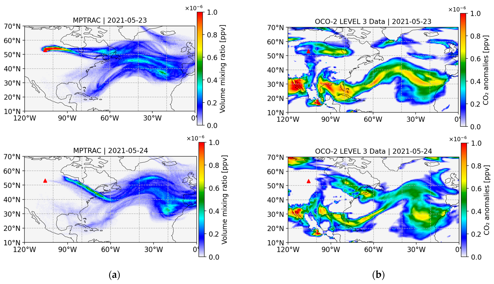

# Tracking Carbon Dioxide with Lagrangian Transport Simulations:Case Study of Canadian Forest Fires in May 2021

Paper:https://doi.org/10.3390/atmos15040429

Reference:https://github.com/slcs-jsc/mptrac

Figure. Maps of CO2 distribution from the Canadian forest fire. (a) Simulation results of MPTRAC. (b) Anomalies calculated from the NASA OCO-2 Level 3 assimilated data product. The red triangle indicates the particle source term position.
